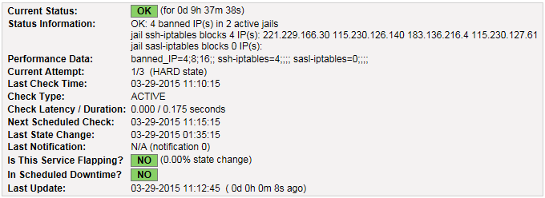

# check_fail2ban.sh

## Man page for the Nagios plugin check_fail2ban.sh

Copyright (c) 2015 Frank4DD<support[at]frank4dd.com>

### check_fail2ban.sh

This plugin checks the number IP blocked by the brute-force protection system fail2ban against warning and critical thresholds. This gives feedback on the level of ongoing brute-force attacks to the system, and can alert for operational problems with fail2ban.

Fail2ban ([Link](http://www.fail2ban.org/wiki/index.php/Main_Page)) is a automated response system mitigating brute-force (password) attacks by dynamically updating firewall rules to block offending systems.

### Usage:

`./check_fail2ban.sh -w <warning-value> -c <critical-value> | -h`

### Options:

-w  
      The total number of blocked IP considered for warning

-c  
      The total number of blocked IP considered critical

-h  
      Displays the plugin usage

### Plugin Usage Example:

Commandline output:

<pre># /srv/app/nagios/lib/check_fail2ban.sh -w 8 -c 12
OK: 4 banned IP(s) in 2 active jails|banned_IP=4;8;12;;
jail ssh-iptables blocks 3 IP(s): 221.229.166.28 117.40.239.54 221.229.166.98
jail sasl-iptables blocks 1 IP(s): 92.222.17.21
| ssh-iptables=3;;;; sasl-iptables=1;;;;</pre>

Nagios plugin call definition in commands.cfg:

<pre>define command{
  command_name check_fail2ban
  command_line $USER1$/check_fail2ban.sh -w $ARG1$ -c $ARG2$
}</pre>

Nagios plugin service definition, e.g. security-services.cfg:

    #######################################################################
    # Check fail2ban blocked IP
    #######################################################################
    define service {
      use                           generic-security # service defs template
      host_name                     susie
      service_description           fail2ban_blocks
      check_command                 check_fail2ban!8!16
    }

Nagios output:

Nagios Graph:

Visualizing the number of fail2ban-blocked IP's gives a good measure and feedback about the ongoing amount of brute-force attacks over time.

### Notes:

The plugin uses the fail2ban-client program to retrieve the data. Fail2ban communicates through a named pipe with the server. The typical location for the pipe is /var/run/fail2ban/fail2ban.sock. Access to this socket is restricted for root only. Best to add access for the Nagios process through a specific ACL.

<pre># setfacl -m u:nagios:rwx /var/run/fail2ban/fail2ban.sock

# getfacl /var/run/fail2ban/fail2ban.sock
getfacl: Removing leading '/' from absolute path names
# file: var/run/fail2ban/fail2ban.sock
# owner: root
# group: root
user::rwx
user:nagios:rwx
group::---
mask::rwx
other::---</pre>
