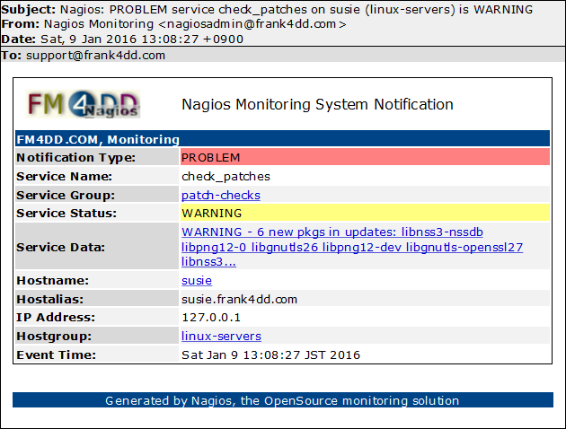

# check_ubuntu_update.pl

## Man page for the Nagios plugin check_ubuntu_update.pl

Copyright (c) 2015 Frank4DD<support[at]frank4dd.com>

### check_ubuntu_update.pl

This plugin checks the patch update status for Ubuntu servers. This alerts when new patches become available from Ubuntu to ensure a timely OS patching, which is especially important for security-related updates.

The plugin depends on the built-in 'apt-get' tool for retrieving update information.

#### Usage:

`./check_ubuntu_update.pl [--debug] [--version] [--help] [--timeout=$TIMEOUT]`  

#### Options:

--debug   
      Add debug information for troubleshooting

--version  
      Returns the plugin version

--help  
     Display the plugin usage information

--timeout=xx  
     Sets a timeout to break from execution in cases of problems

#### Plugin Usage Example:

The plugin returns OK if no updates are available from Ubuntu.

<pre>susie: ~ # ./check_ubuntu_update.pl
OK - No outstanding patches.</pre>

The plugin in 'debug' mode returns addtional output from apt-get.

<pre>susie: ~ # ./check_ubuntu_update.pl --debug
APT: Reading package lists...
APT: Building dependency tree...
APT: Reading state information...
APT: The following packages have been kept back:
APT:   openjdk-7-jre-headless
APT: 0 upgraded, 0 newly installed, 0 to remove and 1 not upgraded.
OK - No outstanding patches.</pre>

If there are updates, the plugin returns warning and displays the package names, up to 80 chars.

<pre>susie: ~ # ./check_ubuntu_update.pl
WARNING - 6 new pkgs in updates: libgnutls-openssl27 libpng12-0 libpng12-dev libnss3-nssdb libgnutls26 libnss3...</pre>

#### Plugin Notification Example:

### Notes:

Various ways exist to run this script on networked servers. My prefered method is to use Linux SNMP extend for remote script execution, as SNMP is typically already used to get Linux load, memory, disk, or network performance data.
